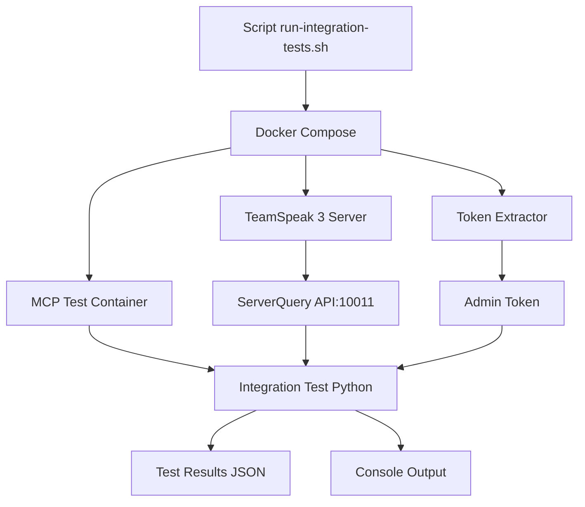

# Tests d'Intégration TeamSpeak MCP

Ce répertoire contient les tests d'intégration complets pour TeamSpeak MCP, utilisant un vrai serveur TeamSpeak 3 via Docker.

## 🎯 **Vue d'ensemble**

Les tests d'intégration valident le fonctionnement de **tous les 18 outils MCP** avec une instance réelle de TeamSpeak 3 Server. Contrairement aux tests unitaires basiques, ces tests :

- ✅ **Testent tous les outils** - Validation complète des 18 fonctionnalités
- ✅ **Serveur réel** - Instance TeamSpeak 3 complète via Docker
- ✅ **Extraction automatique** - Token admin extrait automatiquement
- ✅ **Tests bout-en-bout** - De la connexion au nettoyage
- ✅ **Rapports détaillés** - Résultats JSON avec succès/échecs
- ✅ **CI/CD intégré** - Automatisation via GitHub Actions

## 📁 **Structure des tests**

```
tests/
├── README.md                      # Cette documentation
├── test_integration.py            # Tests d'intégration principaux
└── test_results/                  # Résultats des tests (généré)
    └── integration_results.json   # Rapport JSON détaillé

scripts/
├── run-integration-tests.sh       # Script d'exécution automatisé

docker-compose.test.yml             # Environnement de test complet
.github/workflows/integration-tests.yml  # CI/CD automatique
```

## 🚀 **Utilisation**

### **Méthode 1: Make (Recommandée)**

```bash
# Tests d'intégration complets
make test-integration

# Tests locaux avec docker-compose
make test-integration-local

# Tests en mode CI/CD
make test-integration-ci
```

### **Méthode 2: Script direct**

```bash
# Lancer les tests
./scripts/run-integration-tests.sh

# Vérifier les résultats
cat test_results/integration_results.json
```

### **Méthode 3: Docker Compose manuel**

```bash
# Construire et lancer l'environnement de test
docker-compose -f docker-compose.test.yml build
docker-compose -f docker-compose.test.yml up --abort-on-container-exit

# Nettoyage
docker-compose -f docker-compose.test.yml down --volumes
```

## 🧪 **Tests couverts**

### **Tests de base (4/18)**
- `connect_to_server` - Connexion au serveur TeamSpeak
- `server_info` - Informations du serveur  
- `list_channels` - Liste des canaux
- `list_clients` - Liste des clients connectés

### **Tests de gestion des canaux (6/18)**
- `create_channel` - Création de canaux
- `update_channel` - Modification des propriétés
- `channel_info` - Informations détaillées
- `set_channel_talk_power` - Configuration du talk power
- `manage_channel_permissions` - Gestion des permissions
- `delete_channel` - Suppression (dans cleanup)

### **Tests de gestion des utilisateurs (3/18)**
- `client_info_detailed` - Informations détaillées client
- `manage_user_permissions` (list_groups) - Groupes serveur
- `manage_user_permissions` (list_permissions) - Permissions

### **Tests de messagerie (2/18)**
- `send_channel_message` - Messages de canal
- `send_private_message` - Messages privés

### **Tests de gestion serveur (1/18)**
- `update_server_settings` - Configuration serveur

### **Tests non couverts actuellement (2/18)**
- `move_client` - Déplacement de clients (nécessite plusieurs clients)
- `kick_client` / `ban_client` - Actions modératives (impact sur tests)

## 📊 **Rapports de test**

### **Format JSON**
```json
[
  {
    "tool": "connect_to_server",
    "status": "SUCCESS",
    "message": "Basic connection successful"
  },
  {
    "tool": "create_channel", 
    "status": "SUCCESS",
    "message": "Created channel 15"
  }
]
```

### **Analyse des résultats**
```bash
# Avec jq installé
cat test_results/integration_results.json | jq '[.[] | select(.status == "SUCCESS")] | length'

# Taux de réussite
jq 'length as $total | [.[] | select(.status == "SUCCESS")] | length / $total * 100' test_results/integration_results.json
```

## 🏗️ **Architecture de test**



## 🔧 **Configuration**

### **Variables d'environnement**
```bash
TEAMSPEAK_HOST=teamspeak3-server    # Hostname du serveur TS3
TEAMSPEAK_PORT=10011                # Port ServerQuery
TEAMSPEAK_USER=serveradmin          # Utilisateur admin
TEAMSPEAK_PASSWORD=<auto-extracted> # Token admin (auto)
TEAMSPEAK_SERVER_ID=1               # ID serveur virtuel
```

### **Ports exposés**
- `9987/udp` - TeamSpeak client port
- `10011/tcp` - ServerQuery port (tests)
- `30033/tcp` - File transfer port

## 🚦 **CI/CD Automatique**

### **Déclencheurs GitHub Actions**
- ✅ Push sur `main` ou `develop`
- ✅ Pull requests vers `main`
- ✅ Programmé quotidiennement (2h UTC)
- ✅ Déclenchement manuel

### **Artéfacts générés**
- `integration-test-results-latest.zip`
  - `test_results/integration_results.json`
  - `scripts/admin_token.txt`

## 🐛 **Debugging**

### **Logs de debug**
```bash
# Logs TeamSpeak Server
docker-compose -f docker-compose.test.yml logs teamspeak3-server

# Logs tests MCP
docker-compose -f docker-compose.test.yml logs teamspeak-mcp-test

# Shell interactif dans le container de test
docker-compose -f docker-compose.test.yml run --rm teamspeak-mcp-test shell
```

### **Tests manuels**
```bash
# Test de connectivité
docker-compose -f docker-compose.test.yml run --rm teamspeak-mcp-test debug

# Configuration
docker-compose -f docker-compose.test.yml run --rm teamspeak-mcp-test config
```

## 📈 **Métriques de qualité**

### **Objectifs de couverture**
- 🎯 **16/18 outils** testés automatiquement (89%)
- 🎯 **Taux de réussite** > 95% en CI
- 🎯 **Durée d'exécution** < 5 minutes
- 🎯 **Stabilité** - Pas de flaky tests

### **Limitations actuelles**
- Tests des actions modératives (kick/ban) désactivés
- Tests multi-clients limités (move_client)
- Pas de tests de charge/performance

## 🔄 **Développement**

### **Ajouter un nouveau test**
1. Modifier `tests/test_integration.py`
2. Ajouter la méthode de test dans `run_all_tests()`
3. Tester localement avec `make test-integration-local`
4. Commit et push pour déclencher CI

### **Étendre l'environnement**
1. Modifier `docker-compose.test.yml`
2. Ajouter services ou configuration
3. Mettre à jour le script `run-integration-tests.sh`

## 🎉 **Avantages**

### **Pour les développeurs**
- ✅ **Feedback rapide** - Validation automatique des changements
- ✅ **Confiance** - Tests avec vraie infrastructure
- ✅ **Debugging** - Logs détaillés et environnement reproductible

### **Pour la CI/CD**
- ✅ **Automatisation** - Aucune intervention manuelle
- ✅ **Rapports** - Résultats détaillés et artéfacts
- ✅ **Stabilité** - Environnement contrôlé et reproductible

### **Pour la qualité**
- ✅ **Couverture** - Validation de bout-en-bout
- ✅ **Réalisme** - Tests avec vraie API TeamSpeak
- ✅ **Régression** - Détection automatique des bugs

Cette infrastructure de test représente un **bond qualitatif majeur** pour le projet TeamSpeak MCP ! 🚀 

## 🏗️ Multi-Architecture Support

### Local Development on Different Architectures

Our integration tests support both **ARM64** (Mac M1/M2) and **AMD64** (Intel/CI) architectures:

#### 🍎 **ARM64 (Mac M1/M2)**
```bash
# Automatic detection and image selection
./scripts/run-integration-tests.sh

# Manual override (uses official image with emulation)
export TEAMSPEAK_IMAGE="teamspeak:latest"
export TEAMSPEAK_PLATFORM="linux/amd64"
docker compose -f docker-compose.test.yml up
```

#### 💻 **AMD64 (Intel/CI)**
```bash
# Uses official TeamSpeak image natively
./scripts/run-integration-tests.sh

# Manual override
export TEAMSPEAK_IMAGE="teamspeak:latest"
docker compose -f docker-compose.test.yml up
```

### Architecture Detection

The test script automatically detects your architecture:

```bash
# Output examples:
🏗️ Detected architecture: arm64
🍎 ARM64 detected - Using official TeamSpeak image with emulation
📦 Using TeamSpeak image: teamspeak:latest
⚠️ Note: Running AMD64 image on ARM64 via emulation (slower but compatible)
```

### Troubleshooting Architecture Issues

**Problem**: `no matching manifest for linux/arm64/v8`
```bash
# Solution 1: Use architecture detection script (recommended)
./scripts/run-integration-tests.sh

# Solution 2: Force official image with emulation
export TEAMSPEAK_IMAGE="teamspeak:latest"
export TEAMSPEAK_PLATFORM="linux/amd64"
docker compose -f docker-compose.test.yml up

# Solution 3: Use platform flag directly
docker run --platform linux/amd64 teamspeak:latest
```

**Problem**: `The default license has expired`
- ✅ **Solution**: Always use `teamspeak:latest` (3.13.7+ with valid license until 2027)
- ❌ **Avoid**: `qmcgaw/teamspeak3-alpine` (3.13.6 from 2021 with expired license)

### CI vs Local Differences

| Environment | Architecture | Image Used | Platform | Performance | 
|-------------|-------------|------------|----------|-------------|
| **GitHub Actions** | AMD64 | `teamspeak:latest` | Native | Fast ⚡ |
| **Mac M1/M2** | ARM64 | `teamspeak:latest` | Emulated AMD64 | Slower 🐌 but works ✅ |
| **Intel Mac/Linux** | AMD64 | `teamspeak:latest` | Native | Fast ⚡ |